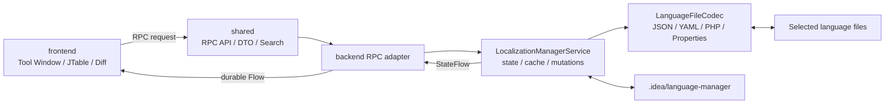
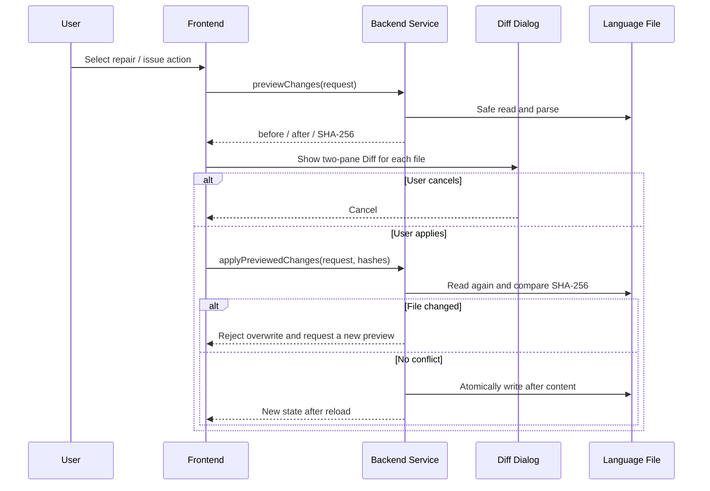

[English](README.md) | [繁體中文](README.zh.md)

# LanguageManager

LanguageManager is a localization file management plugin with JetBrains IDE split-mode support. It manages JSON, YAML/YML, Laravel PHP, and JetBrains/Java ResourceBundle Properties files. The plugin only processes files that the user explicitly selects in a scheme. It never automatically enrolls or rewrites other project files.

The UI and diagnostics are available in English, Traditional Chinese, Simplified Chinese, Japanese, Korean, Spanish, and Thai. The display language follows the IDE by default and can be overridden in the plugin settings.

## Features

- Create isolated language management schemes from explicitly selected files or one or more folders. Folder mode parses files first, previews recognition results, and lets the user add more folders before confirming the managed files.
- Import and export portable scheme settings as JSON from the Tool Window dropdown. Project paths are converted to relative paths when possible, and every imported file receives a parser and security preview.
- JOIN translations with the same `namespace + key` into one table row, with a separate column for each locale.
- Fuzzy and exact search, locale filtering, missing-translation and zero-usage filters, and pagination limited to 100 rows per page.
- Add or edit every locale value in one scrollable form, save the locale mutations as one validated batch, bulk delete, rename keys across locales, copy and paste cells, and launch the IDE-native Find in Files action.
- Batch-translate up to 100 selected rows through an OpenAI-compatible or Anthropic Claude endpoint. The modal defaults editable source text to `en` when available (otherwise the key), supports multiple target locales, and reviews each target in its own editable column before one combined file Diff. API tokens stay in JetBrains PasswordSafe, and optional Temperature is omitted by default. Only **Apply** writes files; **Give AI More Feedback** carries the edited source values, reviewed suggestions, and feedback into a new request round.
- Copy selected keys into one target locale's values, and add framework-specific usage Regex recommendations for major PHP frameworks, Spring/Java/Kotlin, ResourceBundle, and IntelliJ Platform plugins.
- Create a complete new locale from an existing locale—for example, copy the key structure from `en/*.php` into `es/*.php`—using a freely editable code field and an explicit ISO/BCP 47 suggestion popup. The popup never rewrites text while typing. An optional locale note is saved with the scheme and supplied to AI as language, region, terminology, and tone context; every new file is reviewed in a Diff first.
- Configure the plugin display language, issue visibility, and defaults for new schemes in IDE Settings. Existing scheme base paths, Regex patterns, and exclusions are edited independently from the Tool Window.
- Detect parser errors, empty values, duplicate keys, duplicate values, missing locales, and possibly unused keys. Duplicate-value and possibly-unused suggestions can be hidden in settings.
- Accumulate usage occurrences detected by multiple Regex patterns. Repeated calls on one line are counted separately, while overlapping patterns that capture the same key at the same source position are deduplicated.
- The default usage-scan exclusions cover `.git`, `.github`, `docs`, `vendor`, `storage`, `database`, `gradle`, `.gradle`, `build`, `out`, `dist`, `target`, `node_modules`, and IDE-generated directories such as `.idea`, `.fleet`, `.vs`, `.settings`, `.metadata`, and `nbproject`. Users can customize the list.
- Display an IDE two-pane Diff before repairing or deleting. SHA-256 is checked before applying a preview so external changes made after the preview are never overwritten silently.
- Cache parsed state in memory and under `.idea/language-manager/` to reduce repeated parsing.
- Bound parser memory per scheme with configurable per-file size, total content size, per-file entry, and total entry limits. File size is checked before content is read; entry and nesting limits are enforced while parsing.
- The PHP parser accepts only an optional `declare(strict_types=1);` followed by static `return [...]` or `return array(...)` data. It never executes PHP code.

## Documentation

- [User Manual](docs/user_manual_book.md): installation, schemes, translation filters, issue visibility, usage scanning, Diff previews, and troubleshooting.
- [Requirements](docs/需求.md): functional requirements, table filters, issue rules, RPC, security, caching, and acceptance criteria. Currently written in Traditional Chinese.
- [Project Instructions](AGENTS.md): engineering principles, architecture boundaries, localization requirements, tests, and Git conventions.
- [Compatibility Verification](docs/compatibility.md): verified IDE versions and the supported build range.
- [Changelog](CHANGELOG.md)
- Marketplace “What’s New”: generated from the current version section in [CHANGELOG.md](CHANGELOG.md) and injected into `plugin.xml` during the build.

## Usage

1. Install the plugin and open **LanguageManager** from the IDE sidebar.
2. Open the **New Scheme** dropdown and choose file selection or folder selection. Folder mode supports selecting locale directories such as `en`, `zh_CN`, and `zh_TW` together.
3. Folder mode lists each discovered file, format, locale, namespace, entry count, and recognition error. Add more folders from the popup, enter a scheme name, select the recognized files, and confirm.
4. Use search, locale filtering, and translation-status filtering to find rows with missing translations or zero usage. Manage the results with pagination and the **Actions** dropdown.
5. Select one or more rows in **Issues and Suggestions**. Any automatic modification is written only after the user reviews and accepts its Diff.
6. To hide duplicate-value or possibly-unused suggestions, open **Settings → Tools → LanguageManager**.

## Architecture



The root project uses the IntelliJ Platform Gradle Plugin to assemble three content modules:

| Module | Runtime location | Responsibility |
| --- | --- | --- |
| `shared` | frontend and backend | Serializable DTOs, RPC contract, and pure table search/JOIN/pagination logic |
| `frontend` | IDE client | Tool Window, table interaction, dialogs, Diff previews, localized UI, and RPC repository |
| `backend` | IDE backend | Scheme state, file IO, parsers, cache, quality analysis, usage scanning, and RPC implementation |

`build.gradle.kts` sets the plugin installation target to `BOTH`, so each side of split mode receives its required module.

## Key Files

### Root module

| File | Purpose |
| --- | --- |
| `src/main/resources/META-INF/plugin.xml` | Plugin ID, name, description, vendor, and the three content module declarations |
| `src/main/resources/messages/LanguageManagerBundle*.properties` | Five-language dictionaries for the plugin name and description |
| `build.gradle.kts` | IntelliJ IDEA 2025.3.5 minimum compatibility baseline, split mode, plugin modules, tests, and Marketplace change-note injection |
| `gradle.properties` | Release version and Gradle/Kotlin build options |
| `CHANGELOG.md` | Release features and fixes |
| `AGENTS.md` | Product, architecture, security, localization, test, and Git rules |
| `.github/ISSUE_TEMPLATE/` | Bug, feature request, and format compatibility Issue Forms |

### `shared`

| File | Purpose |
| --- | --- |
| `LocalizationModels.kt` | Scheme, locale-note, entry, issue, usage-default, row-filter, folder-recognition, AI-request, mutation, and Diff-preview DTOs |
| `LocalizationManagerRpcApi.kt` | Shared `@Rpc` contract; every remote call identifies its project with `ProjectId` |
| `EntrySearch.kt` | Pure search, `namespace + key` JOIN, missing/zero-usage filters, and pagination capped at 100 rows |

### `frontend`

| File | Purpose |
| --- | --- |
| `toolWindow/LanguageManagerToolWindowFactory.kt` | Creates the Tool Window and localizes its title according to the IDE/plugin language |
| `localization/LocalizationManagerPanel.kt` | Main UI: scheme dropdown, folder recognition, translation and issue tables, clipboard, Diff, and actions |
| `localization/MultiLanguageEntryDialog.kt` | Scrollable add/edit form that lists every locale textarea for one namespace and builds batch mutations |
| `localization/AiTranslationDialogs.kt` | Source/target locale selection, editable AI review, and feedback dialogs for iterative translation rounds |
| `RegexPresetUi.kt` | Framework-aware Regex recommendation menu shared by default and active-scheme settings |
| `localization/LocalizationFrontendRepository.kt` | Converts UI operations to RPC calls and receives backend state through a durable flow |
| `localization/IssueVisibility.kt` | Applies duplicate-value and possibly-unused visibility preferences to the table, counts, and bulk actions |
| `localization/SchemeSettingsTransferDialog.kt` | Safe scheme JSON IO, atomic export, and per-file import preview |
| `settings/LanguageManagerSettings.kt` | Persists display language, issue preferences, new-scheme base path, Regex, and exclusions; migrates old defaults |
| `settings/LanguageManagerSettingsConfigurable.kt` | IDE Settings page for plugin language, issue preferences, and new-scheme defaults |
| `localization/SchemeUsageSettingsDialog.kt` | Edits managed files, scan path, Regex patterns, and exclusions for the active scheme |
| `LanguageManagerBundle.kt` | Frontend resource bundle access |
| `resources/messages/LanguageManagerFrontendBundle*.properties` | Five-language UI dictionaries for buttons, tabs, fields, prompts, and Diff text |
| `resources/icons/toolWindow*.svg` | LanguageManager Tool Window artwork in 16x16/20x20 Light and Dark variants selected automatically by the IDE |

### `backend`

| File | Purpose |
| --- | --- |
| `BackendRpcApiProvider.kt` | Registers `LocalizationManagerRpcApi` in the IntelliJ RPC backend |
| `BackendLocalizationManagerRpcApi.kt` | RPC adapter that delegates requests to the project service on an IO dispatcher |
| `LocalizationManagerService.kt` | Core workflow for schemes, state, cache, CRUD, repair previews, conflict checks, and usage scans |
| `LanguageFileSupport.kt` | Safe path/folder validation, bounded discovery, UTF-8 IO, atomic writes, and JSON/YAML/PHP/Properties parsing/rendering |
| `UsageScanSupport.kt` | Usage setting validation, Regex key extraction, base path scanning, exclusions, and resource limits |
| `LanguageLoadBudget.kt` | Applies pre-parse file-size and post-parse entry budgets across one isolated scheme |
| `EntryMutationSupport.kt` | Applies validated multi-locale add/edit mutations to parsed documents before coordinated atomic writes |
| `AiTranslationSupport.kt` | Validates endpoints, locale-note context, and batch limits; sends OpenAI-compatible/Anthropic requests and strictly validates returned IDs and values |
| `SchemeSettingsTransferSupport.kt` | Versioned scheme JSON including locale notes, relative path conversion, import limits, and security validation |
| `TranslationInputValidation.kt` | Allows spaces, Unicode, and punctuation in keys while rejecting blank, control-character, and oversized input |
| `LocalizationAnalysis.kt` | Builds diagnostics for empty values, duplicate keys/values, missing translations, and unused keys |
| `LanguageManagerBackendBundle.kt` | Backend resource bundle access |
| `resources/messages/LanguageManagerBackendBundle*.properties` | Five-language parser, validation, and diagnostic dictionaries |

### Regression tests

| File | Coverage |
| --- | --- |
| `shared/src/test/kotlin/EntrySearchTest.kt` | Search, JOIN, missing and zero-usage filters, pagination, bulk row counts, and Find in Files Regex generation |
| `shared/src/test/kotlin/LocalizationModelsTest.kt` | Legacy scheme defaults, Unicode/sentence keys, usage Regex, and default exclusions |
| `frontend/src/test/kotlin/IssueVisibilityTest.kt` | Independent visibility preferences without affecting other issue types |
| `frontend/src/test/kotlin/LanguageManagerDefaultSettingsTest.kt` | Base path levels, new-scheme defaults, issue defaults, and legacy exclusion migration |
| `frontend/src/test/kotlin/ToolWindowIconVariantsTest.kt` | Presence, dimensions, and theme colors of all four Tool Window icon variants |
| `backend/src/test/kotlin/UsageScanSupportTest.kt` | Custom Regex, relative exclusions, counts, and rejection of unsafe settings |
| `backend/src/test/kotlin/TranslationInputValidationTest.kt` | Sentence/Unicode keys and rejection of blank, control-character, and oversized keys |
| `backend/src/test/kotlin/SchemeSettingsTransferSupportTest.kt` | Relative path round trips, missing files, parent traversal, and format version rejection |

## RPC API

`LocalizationManagerRpcApi` is the only public contract across the frontend/backend boundary. The frontend resolves it through `RemoteApiProviderService.resolve()`. The backend provider creates the adapter, which resolves `LocalizationManagerService` by `ProjectId`.

| API | Purpose | Writes language files |
| --- | --- | --- |
| `state(projectId)` | Streams schemes, entries, issues, busy state, and errors | No |
| `createScheme(...)` | Validates user-selected files, persists the scheme, and loads it | No; writes plugin scheme data only |
| `deleteScheme(...)` | Deletes a scheme and its cache without deleting language files | No |
| `activateScheme(...)` | Switches the active scheme and loads cache or reparses | No |
| `reload(...)` | Reloads forcibly or according to fingerprints | No |
| `updateSchemeUsageSettings(...)` | Validates and stores base path, Regex, and exclusions, invalidates cache, and recounts | No; writes plugin scheme data only |
| `discoverLanguageFiles(...)` | Safely scans selected folders with the new-scheme loading budget, deduplicates files, and returns recognition results | No |
| `exportSchemeSettings()` | Serializes every scheme into portable, versioned JSON | No |
| `previewSchemeSettingsImport(...)` | Parses JSON, resolves relative paths, and reports file/parser status | No |
| `importSchemeSettings(...)` | Revalidates files and scan settings before creating new schemes | No; writes plugin scheme data only |
| `saveEntry(...)` | Adds or edits one entry; retained for single-cell paste and compatibility | Yes |
| `saveEntries(...)` | Validates and writes all locale values from the scrollable translation form as one batch | Yes |
| `translateWithAi(...)` | Sends transient provider credentials, bounded source/target locale notes, and up to 100 source values to the configured endpoint; returns suggestions only | No |
| `previewEntryMutations(...)` | Renders proposed translation mutations into file-level before/after content and source SHA-256 | No |
| `applyPreviewedEntryMutations(...)` | Rebuilds translation mutations, verifies every preview hash, and atomically writes unchanged sources | Yes |
| `deleteEntries(...)` | Deletes entries by entry ID | Yes |
| `renameKey(...)` | Renames a key in every applicable file of the scheme | Yes |
| `repair(...)` | Normalizes parseable files and fills empty values with their keys | Yes; UI uses preview first |
| `repairEntries(...)` | Repairs specific empty entries | Yes; UI uses preview first |
| `previewLocaleVersion(...)` | Produces new-locale content and a Diff for each file | No |
| `createLocaleVersion(...)` | Verifies preview state, creates locale files, and updates the scheme file list | Yes |
| `previewChanges(...)` | Produces in-memory before/after content and source SHA-256 | No |
| `applyPreviewedChanges(...)` | Rebuilds the preview, verifies hashes, and atomically writes only when unchanged | Yes |

Every service mutation is serialized with one coroutine `Mutex` per project. The RPC adapter moves file operations to `Dispatchers.IO`; Swing updates run only on the EDT.

## Main Execution Flow

### 1. IDE startup and Tool Window creation

1. `plugin.xml` loads the shared, frontend, and backend modules.
2. Backend XML registers `BackendRpcApiProvider`; frontend XML registers the Tool Window.
3. `LanguageManagerToolWindowFactory` creates `LocalizationManagerPanel`.
4. The panel creates a project coroutine scope and collects the repository's durable `state` flow.
5. `LocalizationManagerService` reads `.idea/language-manager/schemes.json` in an IO coroutine and immediately loads the active scheme when one exists.

### 2. Scheme creation and loading

1. The user explicitly selects individual files or one or more folders from the new-scheme dropdown.
2. Folder mode performs bounded, depth-limited, deduplicated discovery, skips dependency/build directories, safely reads supported files, and attempts to parse each one. The frontend popup shows successes and failures and can add more folders.
3. After the user confirms the scheme name and selected recognized files, the backend validates and deduplicates every path again before persisting the scheme.
4. `loadScheme()` computes a `lastModifiedTime XOR size` fingerprint for each file.
5. If the cache format and all fingerprints match, `cache-{schemeId}.json` is loaded directly.
6. On a cache miss, files are parsed independently and entries/parser issues are published before the usage scan finishes.
7. The backend applies the scheme base path, Regex patterns, and exclusions to every regular file under the scan root, regardless of extension or IDE file type. Managed language files are excluded so definitions are not counted as usages.
8. Quality analysis runs, the disk cache is updated, and the complete state is emitted through `StateFlow`.

### 3. Table display and interaction

1. `EntrySearch.filter()` applies the query mode and locale; `filterRows()` then applies missing-translation or zero-usage filtering.
2. `EntrySearch.join()` groups by `namespace + key` and creates one column per locale.
3. `EntrySearch.paginate()` limits every page to 100 rows.
4. Selecting one cell still maps row actions to that cell's row. Find in Files searches only the actual key and never prefixes a filename or bundle namespace.
5. **Find in Files with Usage Regex** replaces the scheme Regex `(?<key>…)` group with the selected literal key, removes boundary anchors, and enables IDE Regex mode.
6. `Ctrl+C` copies selected cells; multiple cells produce TSV. `Ctrl+V` writes only to one locale value cell.
7. `IssueVisibility` applies global preferences consistently to the issue table, status counts, and bulk processing.

### 4. Add, edit, and delete

1. The frontend creates an `EntryMutationDto` or entry ID list.
2. The backend validates the scheme, path, locale, namespace, key length, and control characters. Keys may be natural-language sentences containing spaces, Unicode, and punctuation.
3. The managed file is parsed again so stale UI state cannot overwrite newer content.
4. The modified `ParsedLanguageFile` is rendered in its original format and written atomically.
5. The scheme, analysis, and cache are rebuilt before the latest state is emitted to the UI.

### 5. Repair, normalization, and issue handling



## Format Rules

- A JSON root must be an object. Nested objects are flattened into dotted keys.
- JSON arrays are expanded into ordinary rows such as `sections.0.items.3.title`. Each item supports the same JOIN, search, edit, delete, usage, missing-value, and AI translation actions as a scalar value, while writing reconstructs the original array shape.
- Literal dots in sentence-style JSON keys are preserved through `keyPaths` and do not create accidental nesting.
- YAML supports space-indented `key: value` pairs and nested maps; tab indentation is rejected.
- PHP parses only strings, numbers, booleans, and nested arrays inside `return [...]` or `return array(...)`. Functions and arbitrary expressions are never executed. When files are grouped below a language directory, `en/components/pagination.php` is identified as locale `en` and namespace `components.pagination`.
- Properties supports Java ResourceBundle comments, separators, continuations, and escaping. The base bundle is treated as English; `Bundle_zh_TW.properties` derives locale `zh_TW` and namespace `Bundle`.
- `lang/en.json` derives locale `en` with an empty namespace.
- `lang/en/messages.php` derives locale `en` and namespace `messages`.

## Security and Consistency

- Only ordinary `.json`, `.yaml`, `.yml`, `.php`, and `.properties` files explicitly selected in a scheme are accepted.
- Each file is limited to 10 MB; paths are limited to 4,096 characters.
- URI, LDAP, `file:`, Windows device paths, `GLOBALROOT`, and unsafe control characters are rejected.
- All text is read and written as UTF-8. Output is written to a temporary file in the same directory and then replaced with an atomic move.
- Diff preview is read-only. Apply rebuilds the content and verifies SHA-256 before writing.
- Backend errors are stripped of unsafe control characters and limited to 500 characters before being returned.

## Cache and Storage

Plugin data is stored inside the project:

```text
.idea/language-manager/
├── schemes.json              # Scheme list and active scheme
└── cache-{schemeId}.json     # Fingerprints, entries, and issues
```

The authoritative in-memory state is `LocalizationStateDto`/`StateFlow`. Disk cache only accelerates restart and scheme switching; a changed fingerprint or cache format forces a reparse.

## Development and Testing

The plugin supports JetBrains Platform build `253.5` (IntelliJ IDEA 2025.3.5) and later, with no configured upper bound. See [Compatibility Verification](docs/compatibility.md) for tested versions. Development requires JDK 21 or the JBR bundled with PhpStorm 2026.1.

```powershell
$env:JAVA_HOME='C:\Program Files\JetBrains\PhpStorm 2026.1\jbr'
$env:GRADLE_OPTS='-Dkotlin.incremental=false'

.\gradlew.bat test --no-daemon --console=plain
.\gradlew.bat buildPlugin --no-daemon --console=plain
```

The installable archive is generated at:

```text
build/distributions/LanguageManage-{version}.zip
```

Test coverage includes:

- `shared`: search, JOIN, locale/translation filters, usage defaults, Find in Files queries, and pagination.
- `backend`: JSON/YAML/PHP/Properties parse/render, safe paths, arrays, sentence-style keys, usage Regex/exclusions/counts, analysis, read-only previews, and seven-language bundle parity.
- `frontend`: setting defaults/migration, issue visibility, Tool Window API compatibility, explicit locale selection, controlled locale suggestions, and seven-language bundle parity.

## Version and License

- Releases: [CHANGELOG.md](CHANGELOG.md)
- Marketplace “What’s New”: generated from the matching version in [CHANGELOG.md](CHANGELOG.md)
- License: [LICENSE](LICENSE)
