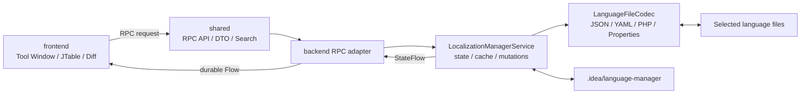
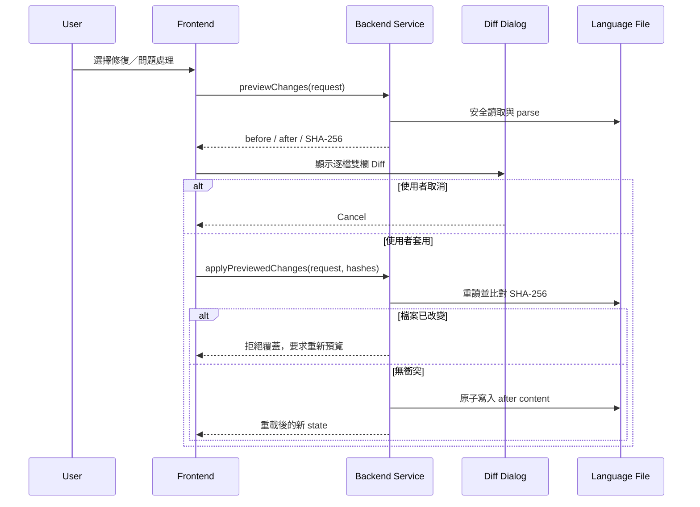

# 在地化管理器 (LanguageManager)

LanguageManager 是支援 JetBrains IDE split mode 的在地化檔案管理插件，用來管理 JSON、YAML/YML、Laravel PHP 與 JetBrains/Java ResourceBundle Properties 語言檔。插件只會處理使用者在「方案」中明確選擇的檔案，不會自動納管或改寫專案內其他檔案。

目前介面與診斷支援英文、繁體中文、簡體中文、日文及韓文，顯示語言跟隨 IDE 設定。

## 主要功能

- 依指定檔案或一個／多個資料夾建立互相隔離的語言管理方案；資料夾模式會先解析並預覽識別結果，也可在 Popup 繼續增加資料夾，再由使用者確認列管檔案。
- 將相同 `namespace + key` 的多國語言翻譯 JOIN 成單一表格，每種語言各為一個欄位。
- 支援模糊搜尋、精準搜尋、語言篩選、缺少翻譯／使用次數為 0 狀態篩選，及每頁最多 100 列的分頁。
- 支援新增、編輯、批量刪除、跨語言 key 改名、儲存格複製／貼上及 IDE 原生全文搜尋。
- 可從現有 locale 建立完整的新語言版本，例如將 `en/*.php` 的 key 結構建立成 `es/*.php`，經 Diff 確認後加入方案。
- IDE Settings 可設定插件顯示語言、問題建議顯示偏好，以及新方案的 base path 模式、向上層級、Regex 與排除清單；既有方案由 Tool Window「方案設定」獨立調整。
- 偵測解析錯誤、空值、重複鍵、重複值、缺少語言及可能未使用的 key；重複值與可能未使用建議可在設定中隱藏。
- 預設使用率排除清單包含 `.git`、`.github`、`docs`、`vendor`、`storage`、`database`、`gradle`、`.gradle`、`build`、`out`、`dist`、`target`、`node_modules`，以及 `.idea`、`.fleet`、`.vs`、`.settings`、`.metadata`、`nbproject` 等 IDE 目錄，並允許使用者自訂。
- 修復或刪除前顯示 IDE 雙欄 Diff；套用前驗證 SHA-256，避免覆蓋預覽後產生的外部修改。
- 以記憶體與 `.idea/language-manager/` 磁碟快取降低重複解析成本。
- PHP parser 只接受可選的 `declare(strict_types=1);` 加上 `return [...]`／`return array(...)` 靜態資料，不執行 PHP 程式碼。

## 文件

- [使用者操作手冊](docs/user_manual_book.md)：安裝、方案、翻譯表狀態篩選、問題顯示偏好、使用率掃描、Diff 與疑難排解。
- [需求規格](docs/需求.md)：功能需求、表格篩選、issue 顯示規則、RPC、安全、快取與驗收條件。
- [專案開發提示](AGENTS.md)：程式原則、架構界線、多國語言、測試與 Git 習慣。
- [版本紀錄](CHANGELOG.md)

## 使用方式

1. 安裝插件後，從 IDE 右側開啟「在地化管理器」。
2. 點選「新增方案」下拉選單，選擇「依檔案選取」或「依資料夾選取」；資料夾模式可一次多選 `en`、`zh_CN`、`zh_TW` 等 locale 目錄。
3. 資料夾模式會列出掃描到的檔案、格式、語言、namespace、筆數與識別錯誤；可在 Popup 使用「增加資料夾」，確認方案名稱及勾選項目後建立方案。
4. 使用搜尋、語言篩選與翻譯狀態篩選，快速找出缺少語言或使用次數為 0 的 row，再透過分頁及「操作」選單管理翻譯。
5. 在「問題與建議」頁籤選擇單列或批量處理；確認 Diff 後才會寫入檔案。
6. 若不需要重複值或可能未使用提示，可在 **Settings → Tools → LanguageManager** 隱藏對應建議。

## 專案架構



根專案使用 IntelliJ Platform Gradle Plugin 組合三個 content module：

| 模組 | 執行位置 | 責任 |
| --- | --- | --- |
| `shared` | frontend 與 backend | 可序列化 DTO、RPC 介面、表格搜尋／JOIN／分頁純邏輯 |
| `frontend` | IDE client | 工具視窗、表格互動、對話框、Diff 預覽、在地化 UI、RPC repository |
| `backend` | IDE backend | 方案狀態、檔案 IO、parser、快取、品質分析、使用率掃描與 RPC 實作 |

`build.gradle.kts` 將插件安裝目標設定為 `BOTH`，使 split mode 的 frontend 與 backend 均取得各自需要的 module。

## 關鍵檔案

### 根模組

| 檔案 | 關鍵資訊 |
| --- | --- |
| `src/main/resources/META-INF/plugin.xml` | 插件 ID、名稱、說明、vendor 與三個 content module 的入口 |
| `src/main/resources/messages/LanguageManagerBundle*.properties` | 插件名稱與說明的五語言字典 |
| `build.gradle.kts` | IntelliJ IDEA 2026.1.3、split mode、plugin module 與測試框架設定 |
| `gradle.properties` | 發布版本與 Gradle/Kotlin 建置選項 |
| `CHANGELOG.md` | 各版本功能與修正紀錄 |
| `AGENTS.md` | 專案開發提示：產品原則、架構、安全、多國語言、測試與 Git 習慣 |
| `.github/ISSUE_TEMPLATE/` | 錯誤、功能需求、格式相容性 Issue Forms 與提交入口設定 |

### `shared`

| 檔案 | 關鍵資訊 |
| --- | --- |
| `LocalizationModels.kt` | 方案、entry、issue、使用率預設、翻譯 row filter、資料夾識別結果、mutation 與 Diff preview DTO |
| `LocalizationManagerRpcApi.kt` | frontend/backend 共用的 `@Rpc` 契約，所有遠端呼叫以 `ProjectId` 定位專案 |
| `EntrySearch.kt` | 純函式形式的搜尋、`namespace + key` JOIN、缺少翻譯／零使用次數篩選及最多 100 列分頁 |

### `frontend`

| 檔案 | 關鍵資訊 |
| --- | --- |
| `toolWindow/LanguageManagerToolWindowFactory.kt` | 建立工具視窗內容、設定依 IDE 語言變化的標題 |
| `localization/LocalizationManagerPanel.kt` | 主要 UI；方案建立下拉選單、資料夾識別視窗、翻譯／問題表、剪貼簿、Diff 與操作事件 |
| `localization/LocalizationFrontendRepository.kt` | 將 UI 操作轉成 RPC；使用 durable flow 接收 backend 狀態 |
| `localization/IssueVisibility.kt` | 根據全域偏好過濾重複值與可能未使用建議，共用於問題表、數量與批量操作 |
| `settings/LanguageManagerSettings.kt` | 持久化顯示語言、issue 顯示偏好、新方案 base path、Regex 與排除清單，並負責舊預設遷移 |
| `settings/LanguageManagerSettingsConfigurable.kt` | IDE Settings 頁面；編輯插件語言、issue 顯示偏好與新方案預設 |
| `localization/SchemeUsageSettingsDialog.kt` | Tool Window 目前方案的列管檔案、掃描路徑、Regex 與排除清單編輯視窗 |
| `LanguageManagerBundle.kt` | frontend `DynamicBundle` 存取入口 |
| `resources/messages/LanguageManagerFrontendBundle*.properties` | 按鈕、頁籤、欄位、提示及 Diff 的五語言字典 |

### `backend`

| 檔案 | 關鍵資訊 |
| --- | --- |
| `BackendRpcApiProvider.kt` | 向 IntelliJ RPC backend 註冊 `LocalizationManagerRpcApi` |
| `BackendLocalizationManagerRpcApi.kt` | RPC adapter；在 IO dispatcher 上把請求委派給 project service |
| `LocalizationManagerService.kt` | 核心主程序：方案、狀態、快取、CRUD、修復預覽、衝突檢查與使用率掃描 |
| `LanguageFileSupport.kt` | 安全路徑／資料夾驗證、受限遞迴探索、UTF-8 讀寫、原子寫入、JSON/YAML/PHP/Properties parse/render |
| `UsageScanSupport.kt` | 使用率設定驗證、Regex key 擷取、base path 掃描、排除目錄與計數限制 |
| `TranslationInputValidation.kt` | 翻譯 key 輸入驗證；允許空格、Unicode 與標點，拒絕空白、控制字元與超長 key |
| `LocalizationAnalysis.kt` | 建立缺失值、重複鍵／值、缺少翻譯及未使用 key 的診斷 |
| `LanguageManagerBackendBundle.kt` | backend `DynamicBundle` 存取入口 |
| `resources/messages/LanguageManagerBackendBundle*.properties` | parser、驗證與診斷的五語言字典 |

### 關鍵回歸測試

| 檔案 | 驗證範圍 |
| --- | --- |
| `shared/src/test/kotlin/EntrySearchTest.kt` | 搜尋、JOIN、缺少翻譯、零使用次數篩選、分頁與批量刪除 row 計數 |
| `shared/src/test/kotlin/LocalizationModelsTest.kt` | 舊方案的使用率預設相容性、Unicode／句子型 key Regex 與預設排除清單 |
| `frontend/src/test/kotlin/IssueVisibilityTest.kt` | 重複值與可能未使用建議可獨立隱藏，其他 issue 不受影響 |
| `frontend/src/test/kotlin/LanguageManagerDefaultSettingsTest.kt` | base path 層級、新方案預設、issue 顯示預設與舊排除清單遷移 |
| `backend/src/test/kotlin/UsageScanSupportTest.kt` | 自訂 Regex、排除相對路徑、計數結果與不安全設定拒絕 |
| `backend/src/test/kotlin/TranslationInputValidationTest.kt` | 句子型／Unicode key 接受，空白、控制字元與超長 key 拒絕 |

## RPC API 邏輯

`LocalizationManagerRpcApi` 是唯一跨 frontend/backend 邊界的公開契約。Frontend 透過 `RemoteApiProviderService.resolve()` 取得 remote API；backend provider 建立 adapter，再依 `ProjectId` 找到 `LocalizationManagerService`。

| API | 用途 | 是否寫入語言檔 |
| --- | --- | --- |
| `state(projectId)` | 持續推送方案、entries、issues、busy 與錯誤狀態 | 否 |
| `createScheme(...)` | 驗證使用者選取的檔案、保存方案並載入 | 否，僅寫入插件方案資料 |
| `deleteScheme(...)` | 刪除方案及其 cache，不刪除語言檔 | 否 |
| `activateScheme(...)` | 切換方案並載入 cache 或重新解析 | 否 |
| `reload(...)` | 強制或依 fingerprint 重新載入 | 否 |
| `updateSchemeUsageSettings(...)` | 驗證並儲存方案 base path、Regex 與排除清單，清除 cache 後重新計算 | 否，僅寫入插件方案資料 |
| `discoverLanguageFiles(...)` | 安全掃描一個／多個指定資料夾，去重後回傳逐檔解析與識別結果 | 否 |
| `saveEntry(...)` | 新增／編輯指定語言檔中的 entry | 是 |
| `deleteEntries(...)` | 依 entry ID 批量刪除 | 是 |
| `renameKey(...)` | 在方案內所有包含舊 key 的檔案中改名 | 是 |
| `repair(...)` | 正規化所有可解析檔案並以 key 補空值 | 是；UI 改走預覽流程 |
| `repairEntries(...)` | 精準修復指定空值 entry | 是；UI 改走預覽流程 |
| `previewLocaleVersion(...)` | 從來源 locale 產生新語言檔案內容與逐檔 Diff | 否 |
| `createLocaleVersion(...)` | 驗證預覽狀態、建立新語言檔並更新方案檔案清單 | 是 |
| `previewChanges(...)` | 在記憶體產生 before/after 與原檔 SHA-256 | 否 |
| `applyPreviewedChanges(...)` | 重建預覽、比對 hash，無衝突才原子寫入 | 是 |

所有 service mutation 由同一個 coroutine `Mutex` 序列化，避免同一專案內的並行操作互相覆蓋。RPC adapter 將檔案工作切至 `Dispatchers.IO`，UI 則只在 EDT 更新 Swing 元件。

## 主程序執行流程

### 1. IDE 啟動與工具視窗建立

1. `plugin.xml` 載入 shared、frontend、backend module。
2. Backend XML 註冊 `BackendRpcApiProvider`；frontend XML 註冊 tool window。
3. `LanguageManagerToolWindowFactory` 建立 `LocalizationManagerPanel`。
4. Panel 建立 project coroutine scope，開始 collect repository 的 durable `state` flow。
5. `LocalizationManagerService` 在背景 IO coroutine 讀取 `.idea/language-manager/schemes.json`；若有 active scheme，立即載入。

### 2. 建立或載入方案

1. 使用者透過新增方案下拉選單選擇個別檔案，或明確指定一個／多個資料夾。
2. 資料夾模式由 backend 對整批目錄限深、限量、去重並略過依賴／建置目錄，逐一安全讀取支援格式並嘗試解析；frontend popup 顯示成功與失敗原因並可繼續增加資料夾。
3. 使用者確認方案名稱與勾選的可識別檔案後，backend 再次驗證路徑、去重並持久化方案。
4. `loadScheme()` 計算每個檔案的 `lastModifiedTime XOR size` fingerprint。
5. Cache format 與 fingerprints 都相符時直接載入 `cache-{schemeId}.json`。
6. Cache miss 時逐檔 parse，先發布 entries 與 parser issues，讓 UI 不必等待使用率掃描。
7. Backend 依方案設定的 base path、Regex 與排除清單，最多掃描 2,000 個、每個不超過 512 KB 的來源檔，計算 key 使用次數。
8. 執行品質分析、更新磁碟 cache，再透過 `StateFlow` 推送完整狀態。

### 3. 表格顯示與互動

1. `EntrySearch.filter()` 依查詢模式與 locale 篩選 entry，`filterRows()` 再篩選缺少翻譯或使用次數為 0 的 JOIN row。
2. `EntrySearch.join()` 以 `namespace + key` 聚合，各 locale 形成獨立欄位。
3. `EntrySearch.paginate()` 將顯示上限限制為每頁 100 列。
4. 單一儲存格仍會映射到該 row，供編輯、刪除與 IDE 全文搜尋使用。
5. `Ctrl+C` 複製所選 cell；多 cell 輸出 TSV。`Ctrl+V` 只允許寫入單一語言 value 欄位。
6. 問題表透過 `IssueVisibility` 套用全域偏好；被隱藏的重複值／可能未使用建議不納入狀態數量或全部批量處理。

### 4. 一般新增、編輯與刪除

1. Frontend 建立 `EntryMutationDto` 或 entry ID 清單。
2. Backend 驗證 scheme、路徑、locale、namespace、key 長度與控制字元；key 可為含空格、Unicode 與標點的自然語言句子。
3. 重新 parse 方案檔案，避免以過期的 UI 狀態直接覆寫。
4. 修改 `ParsedLanguageFile` 後 render 成原格式並執行原子寫入。
5. 強制重載方案、重建分析及 cache，最新狀態再回推 UI。

### 5. 修復、正規化與問題處理



## 格式規則

- JSON 根節點必須是 object；巢狀 object 會展平成點號 key。
- JSON array 以 JSON 文字顯示在 value cell，寫回時保留 array 型別。
- JSON 句子型 key 中的字面句點會透過 `keyPaths` 保留，不會誤建巢狀物件。
- YAML 支援以空白縮排的 `key: value` 與巢狀 map；不接受 tab 縮排。
- PHP 僅解析 `return [...]` 或 `return array(...)` 的字串、數字、布林值與巢狀 array，不執行函式或任意 expression。
- Properties 支援 Java ResourceBundle 的註解、分隔符、續行及跳脫；base bundle 視為英文，`Bundle_zh_TW.properties` 推導 locale 為 `zh_TW`、namespace 為 `Bundle`。
- `lang/en.json` 推導 locale 為 `en`、namespace 為空。
- `lang/en/messages.php` 推導 locale 為 `en`、namespace 為 `messages`。

## 安全與一致性

- 只接受使用者方案中明確選取的 `.json`、`.yaml`、`.yml`、`.php`、`.properties` 一般檔案。
- 單檔上限 10 MB；路徑上限 4,096 字元。
- 拒絕 URI、LDAP、`file:`、Windows device path、`GLOBALROOT` 與不安全控制字元。
- 所有文字以 UTF-8 讀寫；先寫入同目錄 temporary file，再以 atomic move 取代原檔。
- Diff preview 不寫檔；apply 階段會重算內容並驗證 SHA-256。
- Backend error 回傳前會移除不可顯示控制字元並限制為 500 字元。

## 快取與儲存

插件資料存放於專案目錄：

```text
.idea/language-manager/
├── schemes.json              # 方案清單與 active scheme
└── cache-{schemeId}.json     # fingerprints、entries、issues
```

記憶體中的權威狀態為 `LocalizationStateDto`／`StateFlow`。磁碟 cache 只用於加速重啟與方案切換；檔案 fingerprint 或 cache format 改變時會重新 parse。

## 開發與測試

需求：JDK 21，或使用 PhpStorm 2026.1 隨附 JBR。

```powershell
$env:JAVA_HOME='C:\Program Files\JetBrains\PhpStorm 2026.1\jbr'
$env:GRADLE_OPTS='-Dkotlin.incremental=false'

.\gradlew.bat test --no-daemon --console=plain
.\gradlew.bat buildPlugin --no-daemon --console=plain
```

安裝包輸出位置：

```text
build/distributions/LanguageManage-{version}.zip
```

測試範圍：

- `shared`: 搜尋、JOIN、語言／翻譯狀態篩選、使用率預設及分頁。
- `backend`: JSON/YAML/PHP/Properties parse/render、安全路徑、array、句子型 key、使用率 Regex／排除計數、分析、唯讀 preview 與五語資源鍵完整性。
- `frontend`: 設定預設與遷移、issue 顯示過濾、Tool Window API 相容性與五語資源鍵完整性。

## 版本與授權

- 版本紀錄：[CHANGELOG.md](CHANGELOG.md)
- 授權條款：[LICENSE](LICENSE)
